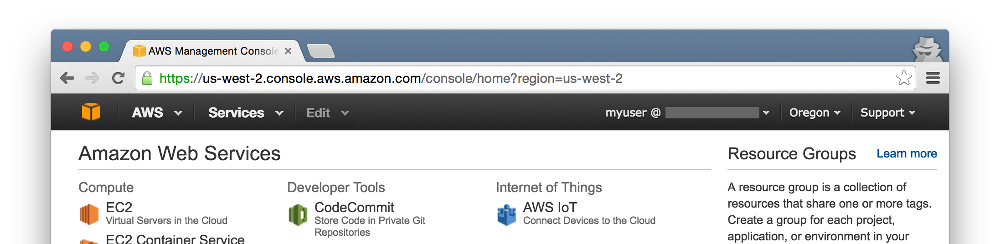

# masecret
A command to mask secret information from images using OCR.

Before:


After:



## Prerequisite

* Python 3
* [Tesseract](https://github.com/tesseract-ocr/tesseract)
  * Languages for OCR (can be set by `--lang`, default is `eng+jpn`) must be available.

## Installation

```
$ pip install masecret
```

`pip` may be `pip3`. You may need `sudo`.

masecret depends on [pyocr](https://github.com/jflesch/pyocr) and [Pillow](https://pillow.readthedocs.io/). If you fail to install Pillow, please see the installation instruction of Pillow.

## Usage

### Preparation

Create a `SECRETS.txt` in a current directory. Content of the file is regular expression patterns which match secret information you want to mask. You can includes multiple patterns using multi lines.

Example content of `SECRETS.txt`:

```
[-—\d]{12,}
```

### Mask Secret

Mask a single file:

```
$ masecret original.png masked.png
```

Mask multiple files (output directory must exist):

```
$ masecret original1.png original2.png ... masked_images/
```

### Full Usage

```
usage: masecret [-h] [-V] [-s SECRET_PATH] [-l LANG] [-c COLOR]
                [--tesseract-configs CONFIGS]
                INPUT [INPUT ...] OUTPUT

Mask secret information from images using OCR.

positional arguments:
  INPUT                 input files
  OUTPUT                output file or directory

optional arguments:
  -h, --help            show this help message and exit
  -V, --version         show program's version number and exit
  -s SECRET_PATH, --secret SECRET_PATH
                        path to secret regex file (default: ./SECRETS.txt)
  -l LANG, --lang LANG  language for OCR (default: eng+jpn)
  -c COLOR, --color COLOR
                        color to fill secrets (default: #666)
  --tesseract-configs CONFIGS
                        comma-separated configs to be passed to tesseract
                        (default: makebox)
```

## Debug

If images are not masked as expected, the environment variable `DEBUG` will help you. If `DEBUG` is set, all the characters tesseract recognized are printed with position.

```
$ DEBUG=1 masecret original.png masked.png
Processing original.png...
A ((214, 39), (229, 56))
W ((229, 39), (249, 56))
S ((250, 39), (264, 56))
M ((273, 39), (290, 56))
a ((292, 44), (304, 56))
n ((305, 44), (316, 56))
a ((318, 44), (329, 56))
g ((331, 44), (342, 61))
e ((344, 44), (355, 56))
m ((357, 44), (374, 56))
e ((376, 44), (387, 56))
n ((389, 44), (400, 56))
t ((401, 40), (408, 56))
C ((416, 39), (431, 56))
o ((433, 44), (445, 56))
n ((447, 44), (457, 56))
s ((459, 44), (470, 56))
o ((471, 44), (482, 56))
X ((513, 41), (527, 55))
...
```

## License

MIT License. See: `LICENSE`.
