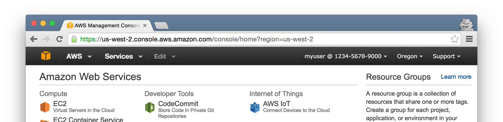

masecret
========

A command to mask secret information of images using OCR.

Before:

After:

.. figure:: docs/masked.png
   :alt: After

Prerequisite
------------

-  Python 3.3+
-  `Tesseract <https://github.com/tesseract-ocr/tesseract>`__

  -  Language data for OCR (can be specified with ``--lang``, default is ``eng``)
     must be available.

Installation
------------

::

    $ pip3 install masecret

You may need ``sudo``.

masecret depends on `pyocr <https://github.com/jflesch/pyocr>`__ and
`Pillow <https://pillow.readthedocs.io/>`__. If you fail to install
Pillow, please see the installation instruction of Pillow.

Usage
-----

Preparation
~~~~~~~~~~~

Create a ``SECRETS.txt`` in a current directory. Content of the file is
regular expression patterns which match secret information you want to
mask. You can includes multiple patterns using multi lines.

Example content of ``SECRETS.txt`` to mask AWS account number:

::

    [-\d]{12,}

Mask Secret
~~~~~~~~~~~

Mask a single file:

::

    $ masecret original.png masked.png

Mask multiple files (output directory must exist):

::

    $ masecret original1.png original2.png ... masked_images/

Full Usage
~~~~~~~~~~

::

    usage: masecret [-h] [-V] [-s SECRET_PATH] [-l LANG] [-c COLOR]
                    [--tesseract-configs CONFIGS]
                    INPUT [INPUT ...] OUTPUT

    Mask secret information of images using OCR.

    positional arguments:
      INPUT                 input files
      OUTPUT                output file or directory

    optional arguments:
      -h, --help            show this help message and exit
      -V, --version         show program's version number and exit
      -s SECRET_PATH, --secret SECRET_PATH
                            path to secret regex file (default: ./SECRETS.txt)
      -l LANG, --lang LANG  language for OCR, can be multiple languages joined by
                            + sign (default: eng)
      -c COLOR, --color COLOR
                            color to fill secrets (default: #666)
      --tesseract-configs CONFIGS
                            (Advanced Option) comma-separated configs to be passed
                            to tesseract (default: makebox)

Debug
-----

If images are not masked as expected, the environment variable ``DEBUG``
will help you. If ``DEBUG`` is set, all the characters tesseract
recognized are printed with position.

::

    $ DEBUG=1 masecret original.png masked.png
    Processing original.png...
    . ((136, 90), (160, 114))
    . ((176, 90), (200, 114))
    . ((216, 90), (240, 114))
    I ((292, 104), (304, 126))
    I ((308, 104), (320, 126))
    A ((326, 104), (340, 120))
    W ((341, 104), (361, 120))
    S ((362, 103), (375, 120))
    M ((385, 104), (401, 120))
    a ((404, 108), (415, 120))
    n ((417, 108), (427, 120))
    a ((430, 108), (440, 120))
    g ((443, 108), (453, 125))
    e ((456, 108), (467, 120))
    m ((469, 108), (485, 120))
    e ((488, 108), (499, 120))
    n ((501, 108), (511, 120))
    t ((513, 105), (519, 120))
    C ((528, 103), (542, 120))
    o ((545, 108), (556, 120))
    n ((559, 108), (569, 120))
    ...

License
-------

MIT License. See: ``LICENSE``.
